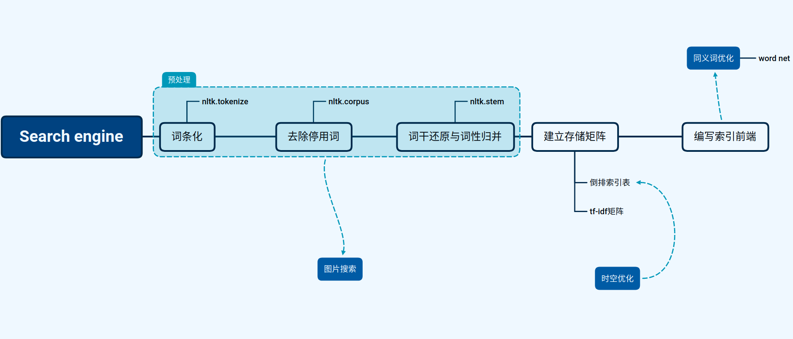
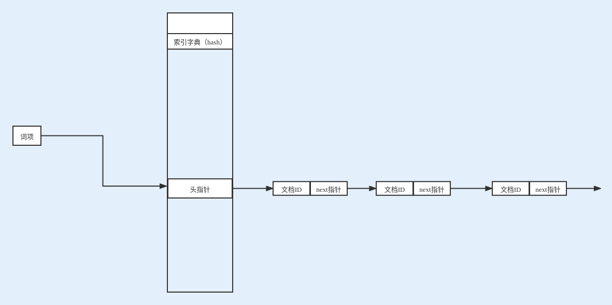
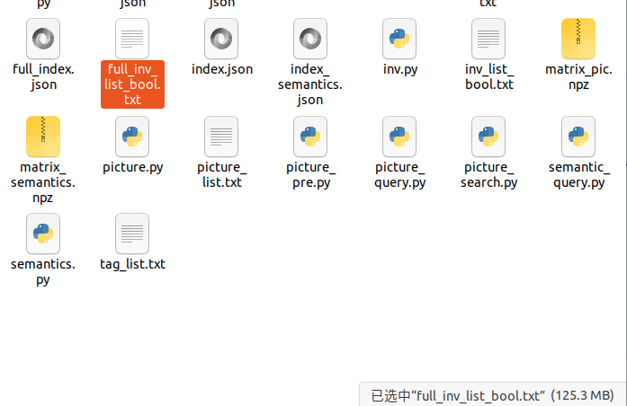
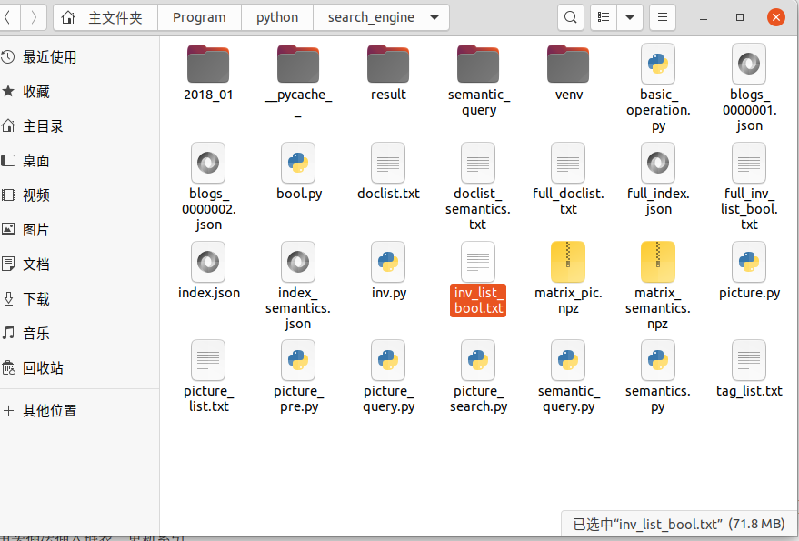
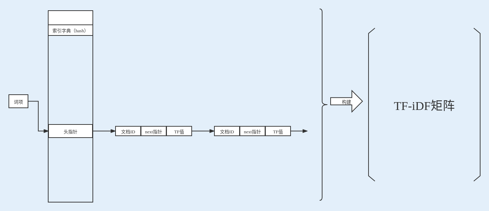
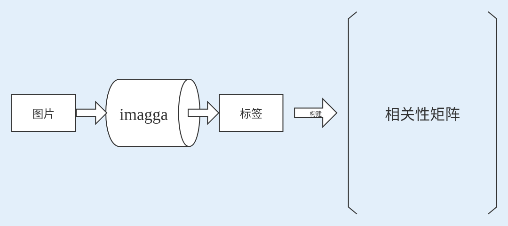
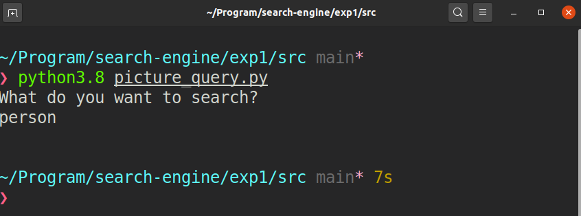

# Web实验一报告

完成者：陈文杰 PB19111656			姜山  PB19111656

---

## 实验环境

+ python3.8

## 实验步骤

本实验遵循以下框架进行



### 布尔检索

索引结构如下



#### 数据结构

+ 索引字典：使用python内置的dict类，Value值为两个整型构成的元组Value值为两个整型

  + next值，指向我们存储倒排索引表文件的某个位置，在此次设计中将整形作为指针使用
  + 最后一个文档ID

  > 使用内置结构原因：起初我设计了一个hash表，使用`SHA-256`进行哈希计算，使用再哈希方法处理（也试过cuckoo hash，不过复杂度高，放弃了）得到的结果是，对一个1800大小的数据集，运行时间为127s, 而使用python自带的字典，其内部也是hash索引，运行时间为126s。因此采用了python自带的字典类

+ 索引链表：在文件中以两行字符存储

  + 文档ID：一串数字，对应文档ID的增量
  + next指针：一串数字，对应位置变化的增量

  > 此处有对于倒排索引表空间占用的优化，起初我们直接使用文档ID，与next指针，不是使用增量，对全数据集运行后，得到的倒排索引表大小为125.3MB
  >
  > 
  >
  > 进行优化后得到的倒排索引表大小为71.8MB
  >
  > 

#### 算法

建立倒排索引表的过程如下：

+ 文档提取与预处理：读取文件后，直接调用`NLTK`文件包中的分词工具，去停用词工具，词根化工具（在`src/inv.py`中`preOp_bool`中，此处不多赘述）

+ 遍历处理结果，将表项使用头插法插入链表，更新索引

  ```python
  for item in tokens:
      inv_location = 0
      try:
          inv_location_pre = index[item][0]
          inv_id_pre = index[item][1]
      except KeyError:
          inv_location_pre = 1
          inv_id_pre = id
      index[item] = (len(str_list), id)
      str_list.append(len(str_list) - inv_location_pre)
      str_list.append(id - inv_id_pre)
  ```

+ 搜索：//TODO


### 支持同义词的布尔检索

与上一项内容基本相似，仅仅是在搜索端算法进行了修改：

//TODO


### 语义检索

索引结构如下



#### 数据结构

+ 索引字典：使用python内置的dict类，Value值为两个整型构成的元组

  + next值，指向我们存储倒排索引表文件的某个位置，在此次设计中将整形作为指针使用
  + DF值

  > 使用内置结构原因：起初我设计了一个hash表，使用`SHA-256`进行哈希计算，使用再哈希方法处理（也试过cuckoo hash，不过复杂度高，放弃了）得到的结果是，对一个1800大小的数据集，运行时间为127s, 而使用python自带的字典，其内部也是hash索引，运行时间为126s。因此采用了python自带的字典类

+ 数据链表：在文件中以两行字符存储
  + 文档ID：整型，对应文档ID
  + next指针：整型，指向下一个数据表
  + TF值：整型，Token在该文档下的TF值
+ TF-iDF矩阵：使用了python的`scipy.sparse`包中的`dok_matrix`存储稀疏矩阵结构

#### 算法

建立倒排索引表的过程如下：

+ 文档提取与预处理：读取文件后，直接调用`NLTK`文件包中的分词工具，去停用词工具，词根化工具（在`src/inv.py`中`preOp_semantics`中，此处不多赘述）

+ 遍历处理结果，将表项使用头插法插入数据链表，更新索引

  ```python
  for item in tokens[0]:
      try:
          inv_location_tup = index[item]
      except KeyError:
          inv_location_tup = (1, 0)
      df = inv_location_tup[1]
      index[item] = (len(data_list), df + 1)
      data_list.append(inv_location_tup[0])
      data_list.append(id)
      data_list.append(tokens[1][tokens[0].index(item)])
  ```

+ 将得到的数据，建立tf-idf矩阵

  ```python
  for item in index:
      inv_location_tup = index[item]
      inv_location = inv_location_tup[0]
      df = inv_location_tup[1]
      while inv_location != 1:
          tf = data_list[inv_location + 2]
          val = (1 + math.log(tf, 10)) * math.log((numofdoc / df), 10)
          S[csr_cnt, doclist[data_list[inv_location + 1]]] = val
          inv_location = int(data_list[inv_location])
      csr_cnt += 1
  ```

+ 搜索：//TODO


### 支持同义词的语义检索

//TODO


### 图片搜索

图片的搜索与上述搜索不同的是，图片不是直接的文字信息，需要提取其中的信息。此处我使用的是`imagga`的`tag`工具，这是一个基于视觉主题对图片分类的工具，可以将我们提供的图片放入他们的ML模型返回图片的内容信息。

图片索引的建立使用以下流程



#### 数据结构

+ 标签：由`imagga`工具返回，为一`JSON`文件，用读取后为一字典，Key值为标签的名字，Value是工具给出的，这个标签的可信度
+ 相关性矩阵：使用了python的`scipy.sparse`包中的`dok_matrix`存储稀疏矩阵结构。其单独的行向量对应一个标签，列向量对应一张图片，每一项就是这个图片的这个标签的可信度

#### 算法

+ 图片的提取与处理：直接打开文件，将其中`main_image`项下的`url`读出，利用`imagga`提供的API得到标签，保存

  > 不过有一个问题，就是imagga免费提供1000个文件的标签服务，所以此次实验我们也仅能有1000大小的数据集，不过从结果看，仍然是比较符合预期的

+ 矩阵的构建：比较暴力地遍历了所有标签文件，每多一个新的标签，矩阵加一行，每多一个图片，矩阵加一行，不过由于使用稀疏矩阵存储，所以空间复杂度不高

+ 搜索：对于搜索`Q`我们仍然使用`NLTK`工具得到{`Q1`,` Q2`, ...}一个搜索词列表，我在此处将工具返回的可信度作为相关性值，将每个图片对应标签向量的可信度相加，得到的值认为是相关性，排序后返回最大的十张图片的文档ID，再去将对应图片下载下来

  ```python
  for pic_index in range(len(total_pic)):
      pic_confidence = 0
      for tag in range(len(tokens)):
          x_coordinate = total_tag.index(tokens[tag] + '\n')
          pic_confidence += s[x_coordinate, pic_index]
      all_con.append([pic_index, pic_confidence])
  
  all_con.sort(key=lambda x: x[1], reverse=True)
  ```

  

## 实验测试

### 布尔检索

//TODO


### 支持同义词的布尔检索

//TODO


### 语义检索

//TODO


### 支持同义词的语义检索

//TODO


### 图片检索

运行程序，输入`person`



得到


显然结果还是比较让人满意的
